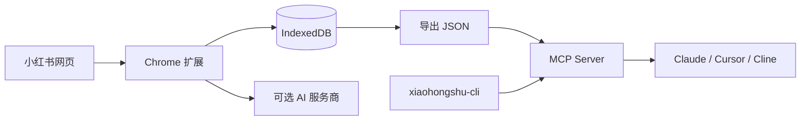
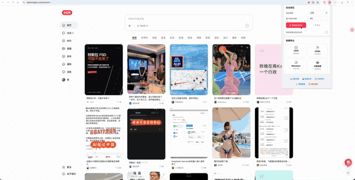

# 小红书内容收集器（XHS Collector）

<div align="center">


本地优先的小红书内容采集、AI 分析与 MCP 工具箱。

浏览器插件负责被动采集和多模态分析，MCP server 可检索本地语料，并通过 `xiaohongshu-cli` 进行实时只读搜索、详情、评论和热门内容读取。

[English](README_EN.md) · [安装](#安装) · [MCP + CLI Bridge](#mcp--cli-bridge) · [更新日志](CHANGELOG.md) · [问题反馈](https://github.com/fancyyan/xiaohongshu-content-collector/issues)

</div>

> [!IMPORTANT]
> 本项目仅用于个人学习、研究和内容管理。请遵守小红书服务条款、当地法律与合理的访问频率。账号限制、验证码或其他平台风控风险由使用者自行承担。

## v1.4.0 新增

- 将本机 [`xiaohongshu-cli`](https://github.com/jackwener/xiaohongshu-cli) 接入现有 MCP server。
- 新增 `xhs_status`、`xhs_search`、`xhs_read`、`xhs_comments`、`xhs_hot` 5 个实时只读工具。
- 将 CLI 结果归一化为插件语料字段，可与本地导出的历史笔记一起分析。
- CLI 调用强制串行、禁用 shell、限制输出大小，并移除 Cookie、`xsec_token` 等认证信息。
- 新增 7 个零依赖集成测试，覆盖字段映射、异常语料、CLI 缺失和敏感信息脱敏。

本次发布只更新独立 MCP server；Chrome 扩展运行时仍为 `v1.3.0`。

## 它能做什么

| 工作流 | 数据来源 | 适合场景 | 网络行为 |
|---|---|---|---|
| Chrome 扩展 | 你在浏览器中正常看到的公开笔记 | 被动采集、批量整理、图文/视频 AI 分析、导出 | 采集数据保存在本地；启用 AI 时会请求你配置的模型服务商 |
| 本地语料 MCP | 插件导出的 JSON | 检索、统计、趋势标签、博主画像、爆款拆解 | 不访问小红书 |
| CLI Bridge | 本机 `xiaohongshu-cli` | 实时搜索、读详情、一页评论、分类热门 | 使用 CLI 的本地登录态访问小红书 |



## 主要功能

- 被动拦截推荐流、搜索、详情页和用户主页数据，并通过 DOM 扫描补全。
- 本地 IndexedDB 去重存储，支持 JSON、JSONL、Markdown 和训练数据导出。
- 支持图文分析、视频多帧分析、爆款潜力、仿写、标签、选题和博主画像。
- 支持 OpenRouter、Anthropic、OpenAI、Google AI、Qwen、DeepSeek、MiniMax 和 OpenAI 兼容端点。
- 支持自动浏览、访问频率控制、随机停顿和可配置预设。
- MCP 提供 6 个本地语料工具、5 个实时 CLI 工具、资源和分析 Prompt。

## 演示

> 浏览小红书 → 自动采集 → 多模态 AI 分析 → 多格式导出

<p align="center"></p>

## 安装

### Chrome 扩展

1. 从 [Releases](https://github.com/fancyyan/xiaohongshu-content-collector/releases) 下载源码包，或克隆仓库：

   ```bash
   git clone https://github.com/fancyyan/xiaohongshu-content-collector.git
   cd xiaohongshu-content-collector
   ```

2. 打开 `chrome://extensions/`。
3. 开启右上角“开发者模式”。
4. 点击“加载已解压的扩展程序”，选择包含 `manifest.json` 的项目目录。

### MCP server

要求：Node.js 18 或更高版本。server 只使用 Node 内置模块，无需 `npm install`。

先确认可运行：

```bash
node mcp/server.mjs --corpus mcp/sample-corpus.json
```

进程等待 stdio MCP 请求属于正常现象。实际使用时应由 Claude Desktop、Cursor、Cline 等 MCP 客户端启动它。

## 快速开始：浏览器插件

1. 正常打开并浏览 [小红书网页版](https://www.xiaohongshu.com/)，插件会被动收集浏览过的公开笔记。
2. 点击浏览器工具栏中的插件图标，查看统计、自动浏览或导出数据。
3. 如需 AI 分析，在设置页选择服务商、填写自己的 API Key 并测试连接。
4. 在详情页、信息流或博主主页打开 AI 面板，选择对应分析模式。

图片数量、视频截帧数、自动浏览速度和访问频率均可在设置页调整。建议先使用保守或均衡预设。

### Google AI 连接与旧模型升级

选择 Google AI，填写自己的 API Key 后，先点「刷新模型列表」，选择支持图片输入、文本输出的 Gemini 模型，再点「测试连接」并保存。无需先测试成功即可刷新。Google 的发现结果只在当前设置会话中保留，更换 Key 后需要重新刷新。

如果之前保存的是 `gemini-2.0-flash-exp` 或其他不再可用的模型，更新扩展后仍会保留原选择并显示提示，请从刷新结果中重新选择和测试。HTTP 404 通常需要换模型；403 请检查权限与服务可用地区；429 请检查配额/计费。测试成功仅确认当前模型能返回文本，图文能力以模型文档为准。

开发验证及浏览器测试命令见 [Google AI 验证说明](docs/google-ai-validation.md)。

## MCP + CLI Bridge

MCP server 支持两类数据源，可以只启用其中一种，也可以同时启用。

### 方式一：查询插件导出的本地语料

在插件 Popup 中选择“数据导出 → JSON”，保存为例如 `~/xhs-corpus.json`，然后配置 MCP 客户端：

```json
{
  "mcpServers": {
    "xhs": {
      "command": "node",
      "args": [
        "/ABSOLUTE/PATH/xiaohongshu-content-collector/mcp/server.mjs",
        "--corpus",
        "/ABSOLUTE/PATH/xhs-corpus.json"
      ]
    }
  }
}
```

- Claude Desktop：`~/Library/Application Support/Claude/claude_desktop_config.json`
- Cursor：项目的 `.cursor/mcp.json`
- Cline：`cline_mcp_settings.json`

每次调用都会重新读取语料文件，重新导出后不需要重启 MCP server。

### 方式二：启用实时只读查询

安装并登录 `xiaohongshu-cli`：

```bash
uv tool install xiaohongshu-cli
xhs login
xhs status
```

如果 `xhs` 不在 MCP 客户端的 `PATH`，在上面的 `args` 中追加：

```json
["--xhs-bin", "/ABSOLUTE/PATH/TO/xhs"]
```

也可以使用环境变量：

```text
XHS_CLI_BIN=/absolute/path/to/xhs
XHS_CLI_TIMEOUT_MS=45000
XHS_CORPUS=/absolute/path/to/xhs-corpus.json
```

CLI Bridge 默认超时 45 秒，允许范围为 5–120 秒。实时调用会串行执行，不会自动翻完全部评论，也不会暴露点赞、收藏、评论、关注、删除或发布操作。

### 工具清单

| 工具 | 数据源 | 作用 |
|---|---|---|
| `search_notes` | 本地语料 | 按关键词、来源、类型或标签检索 |
| `get_note` | 本地语料 | 按 `noteId` 读取完整笔记 |
| `list_creators` | 本地语料 | 按博主聚合笔记与互动 |
| `stats` | 本地语料 | 统计数量、来源、类型、时间和标签 |
| `trending_tags` | 本地语料 | 返回高频标签及样本 |
| `recent_notes` | 本地语料 | 返回最近采集的笔记 |
| `xhs_status` | CLI | 检查登录状态 |
| `xhs_search` | CLI | 实时搜索笔记 |
| `xhs_read` | CLI | 读取一条笔记详情 |
| `xhs_comments` | CLI | 读取一页评论 |
| `xhs_hot` | CLI | 读取分类热门内容 |

更多协议、字段和调试说明见 [mcp/README.md](mcp/README.md)。

### 示例提问

- “搜索 5 条最近的露营笔记，比较标题钩子和互动结构。”
- “从我的本地语料找出高频标签，并给出 5 个差异化选题。”
- “先实时搜索公路车，再读互动最高的一条详情和一页评论，总结用户痛点。”
- “找出本地语料互动最高的博主，生成博主画像和内容支柱。”

## 隐私与安全

- 插件采集的数据默认保存在本机浏览器 IndexedDB；项目本身不提供云端数据仓库。
- 只有当你主动使用 AI 分析时，选中的文本或图片才会发送给你配置的 AI 服务商。
- 本地语料 MCP 不联网；实时 `xhs_*` 工具会通过本机 CLI 访问小红书。
- MCP 不读取插件 API Key，不写入语料，不启动网络端口。
- CLI 子进程不经过 shell，调用限制在只读白名单，输出会过滤临时认证字段。
- 不要提交导出的语料、Cookie、令牌、API Key 或包含个人信息的日志。

## 开发与测试

```bash
node --test tests/google-ai.test.mjs mcp/server.test.mjs
node --check mcp/server.mjs
```

项目结构：

```text
xiaohongshu-content-collector/
├── manifest.json           # Chrome 扩展清单
├── background.js           # Service Worker
├── injector.js             # 页面 API 拦截
├── bridge.js               # 数据与 AI 面板桥接
├── popup/                  # Popup 和设置页
├── lib/storage.js          # IndexedDB 封装
└── mcp/
    ├── server.mjs          # 零依赖 MCP server
    ├── server.test.mjs     # 集成测试
    ├── sample-corpus.json  # 示例语料
    └── README.md           # MCP 开发文档
```

## 常见问题

**不配置 AI API Key 可以使用吗？**  可以。采集、导出和 MCP 本地语料工具不需要 AI API Key。

**视频分析会上传原始视频吗？**  不会。浏览器在本地截取画面，仅把选中的 JPEG 帧发送给已配置的 AI 服务商。

**为什么实时工具提示 `cli_not_found`？**  MCP 客户端通常不会继承终端的完整 `PATH`。请在配置中用 `--xhs-bin` 指定 `xhs` 的绝对路径。

**为什么实时工具提示未登录或验证码？**  请先在同一台机器上运行 `xhs login` 和 `xhs status`。登录态及验证码处理由 `xiaohongshu-cli` 管理。

**如何更新本地语料？**  重新从插件导出到同一个 JSON 文件即可，MCP 每次调用都会重新读取。

## 致谢

特别感谢 [jackwener](https://github.com/jackwener) 开源并维护 [`xiaohongshu-cli`](https://github.com/jackwener/xiaohongshu-cli)。XHS Collector `v1.4.0` 的实时只读 MCP Bridge 建立在该项目提供的 CLI 能力之上。

## 贡献

欢迎通过 [Issues](https://github.com/fancyyan/xiaohongshu-content-collector/issues) 报告问题或提出建议，也欢迎 Fork 后提交 Pull Request。提交前请运行 MCP 测试，并确认改动中不包含账号凭证和个人语料。

## 许可证

[MIT](LICENSE)

<div align="center">

如果项目对你有帮助，欢迎点一个 ⭐

Made with ❤️ by [Fancy Yan](https://github.com/fancyyan)

</div>
