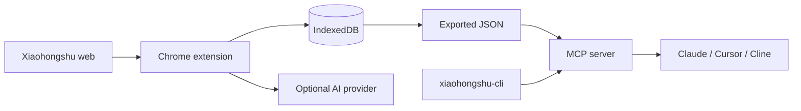

# Xiaohongshu Content Collector (XHS Collector)

<div align="center">


A local-first Xiaohongshu collection, AI analysis, and MCP toolkit.

The Chrome extension passively collects content and provides multimodal analysis. The MCP server searches your local corpus and can use `xiaohongshu-cli` for live, read-only search, note details, comments, and trending feeds.

[中文](README.md) · [Install](#installation) · [MCP + CLI Bridge](#mcp--cli-bridge) · [Changelog](CHANGELOG.md) · [Issues](https://github.com/fancyyan/xiaohongshu-content-collector/issues)

</div>

> [!IMPORTANT]
> This project is intended for personal learning, research, and content management. Follow Xiaohongshu's terms, applicable laws, and reasonable request rates. You are responsible for account restrictions, verification challenges, and other platform risks.

## What's new in v1.4.0

- Connects the local [`xiaohongshu-cli`](https://github.com/jackwener/xiaohongshu-cli) to the existing MCP server.
- Adds five live, read-only tools: `xhs_status`, `xhs_search`, `xhs_read`, `xhs_comments`, and `xhs_hot`.
- Normalizes CLI responses to the extension's corpus schema so live and exported notes can be analyzed together.
- Serializes CLI calls, disables shell execution, limits output size, and strips Cookie and `xsec_token` values.
- Adds seven dependency-free integration tests covering field mapping, malformed corpora, a missing CLI, and credential redaction.

This release only updates the standalone MCP server. The Chrome extension runtime remains at `v1.3.0`.

## What it does

| Workflow | Data source | Best for | Network behavior |
|---|---|---|---|
| Chrome extension | Public notes you view in the browser | Passive collection, organization, image/video AI analysis, export | Collection stays local; AI analysis calls your configured model provider |
| Local corpus MCP | JSON exported by the extension | Search, statistics, trending tags, creator profiles, viral breakdowns | Does not access Xiaohongshu |
| CLI Bridge | Local `xiaohongshu-cli` | Live search, note details, one page of comments, category feeds | Uses the CLI's local login session to access Xiaohongshu |



## Features

- Passive interception across feeds, search, note detail pages, and creator profiles, with supplemental DOM scanning.
- Deduplicated local IndexedDB storage and JSON, JSONL, Markdown, and training-data exports.
- Image-post analysis, multi-frame video analysis, viral-potential review, rewriting, tags, topic ideas, and creator profiles.
- OpenRouter, Anthropic, OpenAI, Google AI, Qwen, DeepSeek, MiniMax, and OpenAI-compatible endpoints.
- Auto-browsing with rate controls, randomized pauses, and configurable presets.
- MCP with six local-corpus tools, five live CLI tools, resources, and analysis prompts.

## Demo

> Browse Xiaohongshu → collect automatically → run multimodal AI analysis → export in multiple formats

<p align="center"></p>

## Installation

### Chrome extension

1. Download the source archive from [Releases](https://github.com/fancyyan/xiaohongshu-content-collector/releases), or clone the repository:

   ```bash
   git clone https://github.com/fancyyan/xiaohongshu-content-collector.git
   cd xiaohongshu-content-collector
   ```

2. Open `chrome://extensions/`.
3. Enable **Developer mode**.
4. Click **Load unpacked** and select the project directory containing `manifest.json`.

### MCP server

Requirements: Node.js 18 or later. The server uses Node built-ins only, so there is no `npm install` step.

Verify that it starts:

```bash
node mcp/server.mjs --corpus mcp/sample-corpus.json
```

The process waiting for stdio MCP requests is expected. In normal use, an MCP client such as Claude Desktop, Cursor, or Cline starts it for you.

## Quick start: browser extension

1. Open the [Xiaohongshu website](https://www.xiaohongshu.com/) and browse normally. The extension passively collects public notes you view.
2. Open the extension popup to view statistics, start auto-browsing, or export data.
3. For AI analysis, choose a provider in Settings, enter your own API key, and test the connection.
4. Open the AI panel on a note, feed, or creator page and select an analysis mode.

Image limits, video frame count, auto-browse speed, and request frequency are configurable. Start with the conservative or balanced preset.

### Google AI setup and model upgrades

Select Google AI, enter your own API key, then refresh the model list before testing. Choose a Gemini model with image input and text output, test the connection, and save. Discovery does not require a successful connection test. Its results are kept only for the current settings session and cleared when the key changes.

Previously saved models such as `gemini-2.0-flash-exp` remain selected with a warning until you choose and test a replacement. For HTTP 404, refresh and select an available model; for 403, check permissions and supported regions; for 429, check quota and billing. A successful text test does not verify image support.

See [Google AI validation notes](docs/google-ai-validation.md) for development checks and browser test commands.

## MCP + CLI Bridge

The MCP server supports two independent data sources. You can enable either one or both.

### Option 1: query an exported local corpus

In the extension popup, choose **Data Export → JSON** and save it as, for example, `~/xhs-corpus.json`. Then configure your MCP client:

```json
{
  "mcpServers": {
    "xhs": {
      "command": "node",
      "args": [
        "/ABSOLUTE/PATH/xiaohongshu-content-collector/mcp/server.mjs",
        "--corpus",
        "/ABSOLUTE/PATH/xhs-corpus.json"
      ]
    }
  }
}
```

- Claude Desktop: `~/Library/Application Support/Claude/claude_desktop_config.json`
- Cursor: `.cursor/mcp.json` in your project
- Cline: `cline_mcp_settings.json`

The server reloads the corpus on every tool call. Exporting to the same file updates the data without a restart.

### Option 2: enable live, read-only queries

Install and authenticate `xiaohongshu-cli`:

```bash
uv tool install xiaohongshu-cli
xhs login
xhs status
```

If `xhs` is not available on the MCP client's `PATH`, append this to the `args` array above:

```json
["--xhs-bin", "/ABSOLUTE/PATH/TO/xhs"]
```

Environment variables are also supported:

```text
XHS_CLI_BIN=/absolute/path/to/xhs
XHS_CLI_TIMEOUT_MS=45000
XHS_CORPUS=/absolute/path/to/xhs-corpus.json
```

The CLI Bridge defaults to a 45-second timeout, configurable from 5 to 120 seconds. Live calls are serialized, comments are never auto-paginated to completion, and like, favorite, comment, follow, delete, and publish actions are not exposed.

### Tool reference

| Tool | Source | Purpose |
|---|---|---|
| `search_notes` | Local corpus | Search by keyword, source, type, or tag |
| `get_note` | Local corpus | Read a complete note by `noteId` |
| `list_creators` | Local corpus | Aggregate notes and engagement by creator |
| `stats` | Local corpus | Summarize counts, sources, types, dates, and tags |
| `trending_tags` | Local corpus | Return frequent tags and examples |
| `recent_notes` | Local corpus | Return the latest collected notes |
| `xhs_status` | CLI | Check authentication status |
| `xhs_search` | CLI | Search notes live |
| `xhs_read` | CLI | Read one note in detail |
| `xhs_comments` | CLI | Read one page of comments |
| `xhs_hot` | CLI | Read a category's trending feed |

See [mcp/README.md](mcp/README.md) for protocol details, schemas, and local debugging.

### Example prompts

- “Search for five recent camping notes and compare their title hooks and engagement structure.”
- “Find the most frequent tags in my local corpus and suggest five differentiated topics.”
- “Search live for road-bike posts, read the top result and one page of comments, then summarize user pain points.”
- “Find the highest-engagement creator in my corpus and produce a creator profile and content pillars.”

## Privacy and security

- Collected data is stored in the browser's local IndexedDB by default; this project does not provide a cloud data store.
- Text or images are sent to your configured AI provider only when you explicitly run AI analysis.
- Local corpus tools do not access Xiaohongshu. Live `xhs_*` tools access it through your local CLI.
- The MCP server does not read extension API keys, modify the corpus, or open a network port.
- CLI subprocesses do not use a shell, are restricted to a read-only allowlist, and redact temporary credential fields from output.
- Never commit exported corpora, cookies, tokens, API keys, or logs containing personal information.

## Development and testing

```bash
node --test tests/google-ai.test.mjs mcp/server.test.mjs
node --check mcp/server.mjs
```

Project layout:

```text
xiaohongshu-content-collector/
├── manifest.json           # Chrome extension manifest
├── background.js           # Service Worker
├── injector.js             # Page API interception
├── bridge.js               # Data and AI panel bridge
├── popup/                  # Popup and settings UI
├── lib/storage.js          # IndexedDB wrapper
└── mcp/
    ├── server.mjs          # Dependency-free MCP server
    ├── server.test.mjs     # Integration tests
    ├── sample-corpus.json  # Sample corpus
    └── README.md           # MCP developer documentation
```

## FAQ

**Can I use it without an AI API key?**  Yes. Collection, export, and local corpus MCP tools do not require an AI API key.

**Does video analysis upload the original video?**  No. Frames are extracted locally in the browser, and only the selected JPEG frames are sent to your configured AI provider.

**Why does a live tool return `cli_not_found`?**  MCP clients often do not inherit your terminal's full `PATH`. Set `--xhs-bin` to the absolute path of the `xhs` executable.

**Why does a live tool report that I am logged out or need verification?**  Run `xhs login` and `xhs status` on the same machine first. Authentication and verification are managed by `xiaohongshu-cli`.

**How do I refresh the local corpus?**  Export to the same JSON file again. The MCP server reloads it on every call.

## Acknowledgments

Special thanks to [jackwener](https://github.com/jackwener) for creating and maintaining [`xiaohongshu-cli`](https://github.com/jackwener/xiaohongshu-cli). The live, read-only MCP Bridge in XHS Collector `v1.4.0` is built on the CLI capabilities provided by that project.

## Contributing

Use [Issues](https://github.com/fancyyan/xiaohongshu-content-collector/issues) for bugs and suggestions, or fork the project and open a pull request. Run the MCP tests before submitting and verify that your changes contain no credentials or personal corpus data.

## License

[MIT](LICENSE)

<div align="center">

If this project helps you, a ⭐ is appreciated.

Made with ❤️ by [Fancy Yan](https://github.com/fancyyan)

</div>
